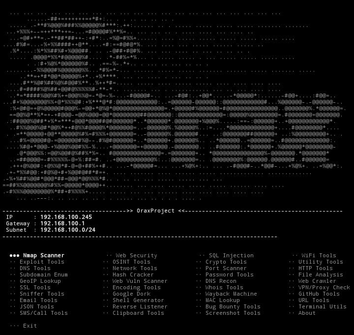

# OraxProject

Termux toolkit buat network & security testing. Isinya 40 tools mulai dari Nmap scanner, web security, SQL injection tester, sampai utility lokal. Semua plugin modular — mau nambah tool sendiri tinggal taruh file di `plugins/`, otomatis kebaca.

Ada juga asisten AI (Groq) yang bisa baca/bikin file, jalanin command, dan ngobrol langsung dari terminal.

---

## Preview

Screenshot tools di terminal:



Banner OraxProject:


---

## Fitur

**Scanner & Network**
- Nmap (ping sweep, quick scan, full port, OS detect, vuln scan)
- Port scanner (top 100/1000, custom range)
- WiFi info & ARP table
- Subdomain enum + DNS recon
- SSL cert checker

**Web Security**
- HTTP header checker
- Directory buster
- CMS detect (WordPress, Joomla, Drupal)
- XSS / LFI / CORS test
- Web crawler (link, email, JS extract)
- Wayback machine lookup

**SQL & Exploit**
- Basic/error/time/union-based SQLi test
- SQLMap wrapper
- Shell generator (bash, python, php, nc, powershell)
- Reverse listener (nc, python, socat)

**OSINT & Recon**
- Username search (multi-platform)
- GeoIP lookup
- GitHub user/repo info
- Google dork generator
- Email validator + MX check

**Utility**
- Base64 / hex / URL / HTML encode-decode
- Hash cracker (MD5, SHA1, SHA256)
- Password generator & strength check
- File analysis (hash, type, strings)
- JSON formatter
- Terminal system info

**AI Assistant (Groq)**
- Chat interaktif dari terminal
- Baca file & folder
- Bikin file & folder baru
- Jalanin command shell
- Kontrol penuh ke Termux

---

## Requirements

- Termux (dari F-Droid, **jangan** dari Play Store — versinya outdated)
- Android 7+
- Koneksi internet (buat AI & beberapa tool online)

Tool wajib:

```bash
cd OraxProject
pkg update && pkg upgrade -y
pkg install curl jq nmap whois dnsutils openssl git python -y
pip install --upgrade pip
chmod +x orax.sh
chmod +x plugins/*.sh
chmod +x ai.sh 2>/dev/null
chmod +x orax_cli.sh 2>/dev/null
hash -r
source ~/.bashrc
*Optional (kalau mau fitur lengkap* :
pkg install tcpdump sqlmap file traceroute netcat-openbsd qrencode termux-api -y

Command Fungsi
cd ~/OraxProject Masuk ke folder project
ls -la Lihat isi folder
bash orax.sh Jalanin tanpa install global
./orax.sh Jalanin (kalau udah di folder & executable)
orax --menu Buka menu utama
orax --help Bantuan CLI
oai --{pertanyaan} Tanya AI langsung
oai Mode chat interaktif
oai --model {nama} Ganti model AI
oai --model Lihat model aktif
oai --reset Hapus history chat
oai --history Lihat history chat
apikey --{api_key} Set Groq API key
